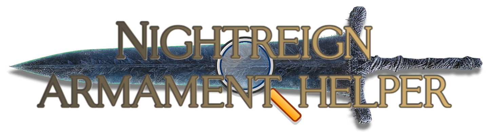
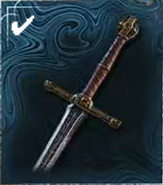
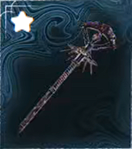
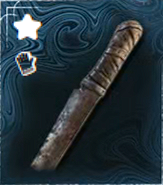
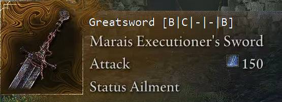
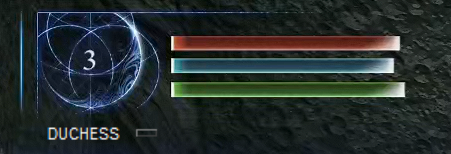
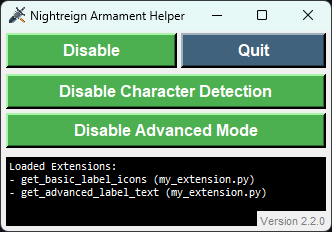

# Nightreign Armament Helper

<p align="center">
    
</p>

## Description

**Nightreign Armament Helper** is an Overlay mod for Elden Ring: Nightreign that is safe to use ONLINE and with EAC ENABLED. It aims to help players choose the best armaments for the character they are using. It does this in a very simple manner, by displaying three separate icons directly on top of the armament's image.

- ✔️: The weapon's stats are a **decent match** for the character's stats.
- ⭐: The weapon's stats are a **great match** for the character's stats.
- 🧤: The weapon is of the **type preferred** by the character.

<p align="center">
    
    &nbsp;&nbsp;&nbsp;&nbsp;&nbsp;&nbsp;&nbsp;&nbsp;&nbsp;&nbsp;
    
    &nbsp;&nbsp;&nbsp;&nbsp;&nbsp;&nbsp;&nbsp;&nbsp;&nbsp;&nbsp;
    
</p>

Additionally, as of version 1.1.0, the mod also provides an **Advanced Mode** that in addition to the simple recommendation icons, also displays an armament's type and stats.

<p align="center">
    
</p>

*Note:* The **Advanced Mode** being enabled does not impact performance in any way, so feel free to enable it if you prefer.

*Recommendations:*
- The **basic mode is recommended for newer players**, as it is simpler and easier to understand at a glance.
- The **advanced mode is recommended for experienced players** who want to see more information about the armament they are using, such as its type and stats.

## How to use

The mod does not require any installation. Simply download the latest version of the `NightreignArmamentHelper.exe` file from the [Releases](https://github.com/AfonsoG6/NightreignArmamentHelper/releases) page and execute it while Elden Ring: Nightreign is running.

The mod will immediately start working, attempting to detect the character being chosen and the armament being viewed.

**IMPORTANT**: The overlay requires the game to be running in **BORDERLESS WINDOWED** mode to work correctly.

Additionally, you may verify and/or manually change the currently selected character through the very discreet dropdown menu in the top left corner of the screen.

<p align="center">
    
</p>

Furthermore, an additional window containing a control panel for the mod will appear. This window allows you to perform the following actions:

- Temporarily disable/enable the mod, without closing it.
- Disable/enable the automatic detection of the character.
- Disable/enable the advanced mode, which shows additional information about the armament.
- Fully stop the mod.

<p align="center">
    
</p>

## Common Questions

### How does it work?

The mod uses Optical Character Recognition (OCR) to detect several elements on the screen, such as the currently opened menu, the character name (only on the character selection screen), and the armament name.

It then uses this information to determine which weapon the player is currently looking at and which character they are using. Based on this information, it then displays the icons mentioned above.

It is also important to note that the mod defines the categories "great" and "decent" based on a custom mathematical algorithm, which sometimes may not match the player's expectations. If you think that a weapon should be marked as "great" or "decent" but it is not, please open an issue on GitHub.

As of version 1.2.0, the mod also implements an **eventual responsiveness** method that learns, through analysis of perfect OCR matches, a set of reference points to detect the same text in the future without having to call the OCR again. As these reference points are learned, they are stored in the user's %LOCALAPPDATA% folder, thus persisting across game sessions.

*Note:* If the resolution of the screen is changed, the mod will have to relearn all the reference points for the new resolution. This is because the reference points are based on the position of the text on the screen, which may change with different resolutions.

### Will I get banned for using this mod?

**No**, you will not get banned for using this mod. The mod does not modify the game files in any way, and it does not interact with the game's memory. It simply reads the screen and displays information based on that.

## Limitations

1. **Display Mode**: For the overlay to be correctly shown on top of the game window, the game must be running in borderless windowed mode.
2. **Ground items**: Items found in the ground show their details in varying locations, making it difficult to detect them in a both efficient and accurate way. Therefore, the mod does not support the detection of items found on the ground. To circumvent this, you can simply pick up the item and then open the inventory to view its details.
3. **Language**: The mod is designed to work with the English version of Elden Ring: Nightreign. It may not work correctly with other languages, as the OCR is trained on English text. If you are using a different language and the mod is not working correctly, please open an issue on GitHub.
4. **Responsiveness**: The mod is designed to be as efficient and responsive as possible, through the usage of *ImageHash* comparisons to detect screen area changes and thus avoid unnecessary OCR calls, as well as the OCR configuration being optimized for speed. However, it may sometimes take half a second to detect the armament and show the corresponding icons. This is due to the nature of OCR and the fact that it needs to analyze the screen in real-time. If you notice that the mod is not responding quickly enough, please open an issue on GitHub.
5. **Accuracy**: The mod uses OCR to detect text on the screen, which is not always 100% accurate. This means that it may sometimes fail to detect the armament or the character correctly. To mitigate this, we use the *Jaccard* similarity algorithm to account for small innacuracies in the OCR results. During our testing, we found that the mod seems to always be able to detect the armament and character correctly, but there may be some edge cases where this fails.

## Optional: Manual Compilation

If you want to compile the program yourself, you will need to have Python 3.10 or later installed.

You will also need to install the packages listed in `requirements.txt`. You can do this by running the following command in your preferred terminal:

```bash
pip install -r requirements.txt
```

Additionally, you must install [Tesseract-OCR](https://github.com/UB-Mannheim/tesseract/wiki) either directly to the main directory of the project or to the default location and then copy it.

Lastly, run the following command to compile the program:

```bash
pyinstaller --onefile --noconsole --icon=images/icon.ico --add-data "Tesseract-OCR;Tesseract-OCR" --add-data "images/icon.png;images" -n NightreignArmamentHelper main.py
```

Upon successful completion, you will find the executable in the `dist` folder.

## License

This project is licensed under the MIT License. See the [LICENSE](LICENSE) file for details.

## Acknowledgements

Thanks to [lud-berthe](https://github.com/lud-berthe) for the original idea which inspired me to make this mod.
The ideas of using Tesseract-OCR to safely get information from the game and a simple Overlay to also safely provide additional information to the player all came from his project.

Check out his mod **Nightreign Auto-Timer** on [Nexus Mods](https://www.nexusmods.com/eldenringnightreign/mods/139) or on [GitHub](https://github.com/lud-berthe/nightreign-auto-timer) if you haven't already.

## Support my work

If you like this project and want to support its development, you can buy me a coffee through [Ko-fi](https://ko-fi.com/afonsog6). Thank you!

<p align="center">
    <a href="https://ko-fi.com/afonsog6"></a>
</p>